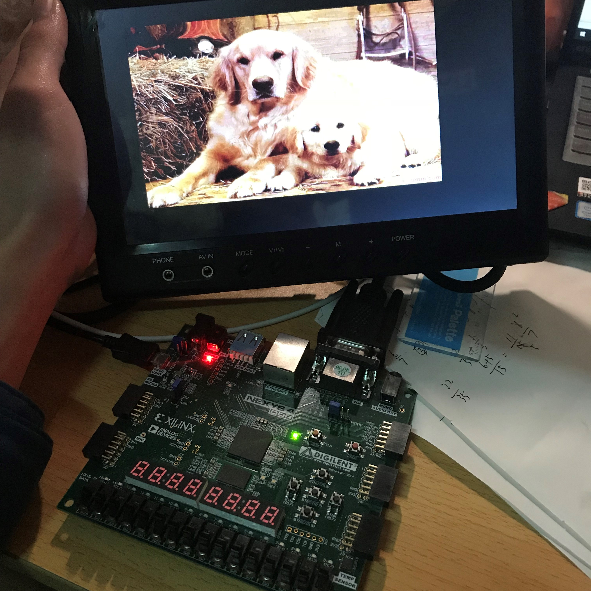
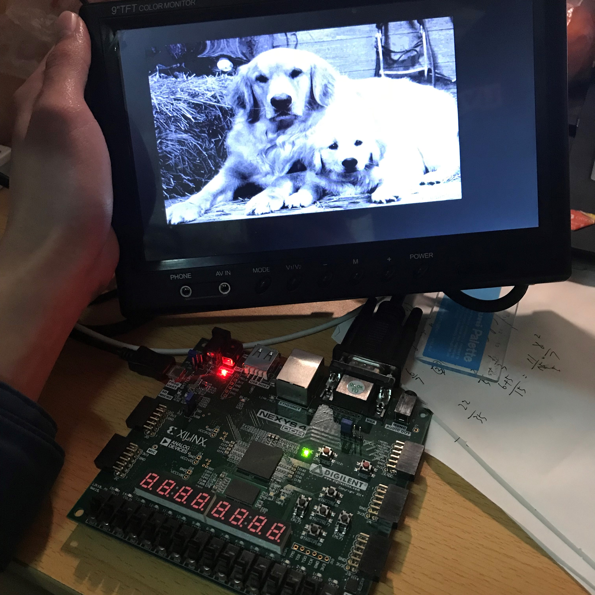
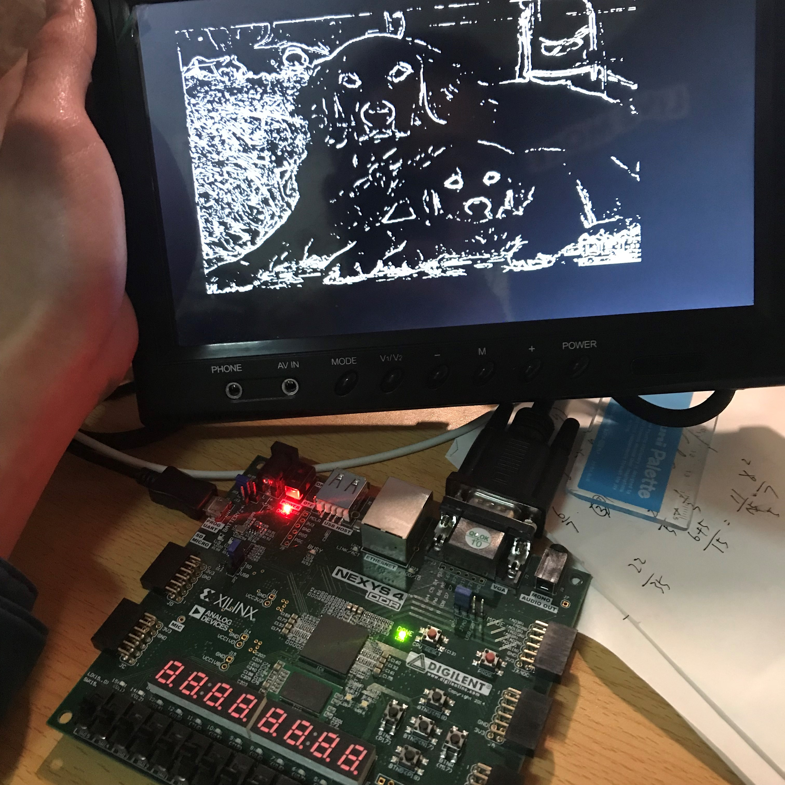
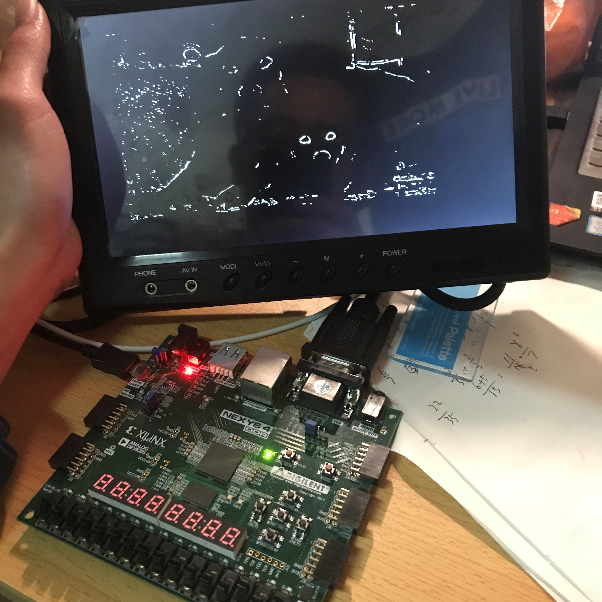
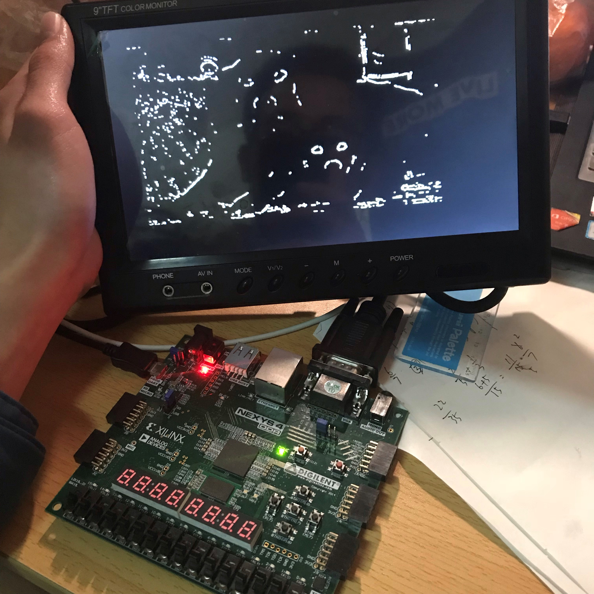

# FPGA-based-image-processing
## Feature
* Verilog实现Uart串口传输协议，可将图片从电脑串口发送至FPGA 
* 在Nexys4开发板上用Verilog流水线结构对图像进行灰度化、高斯模糊降噪、Sobel边缘检测、腐蚀、膨胀
* 可通过Nexy4板上的开关将各步骤中间结果输出到VGA显示屏上
* 
## Result
### Origin picture

### Gray

### Sobel Edge Detect

### Erosion

### Dilate

## Environment
* FPGA: Nexys 4
* Vivado 2016.4
* Verilog
* Modelsim